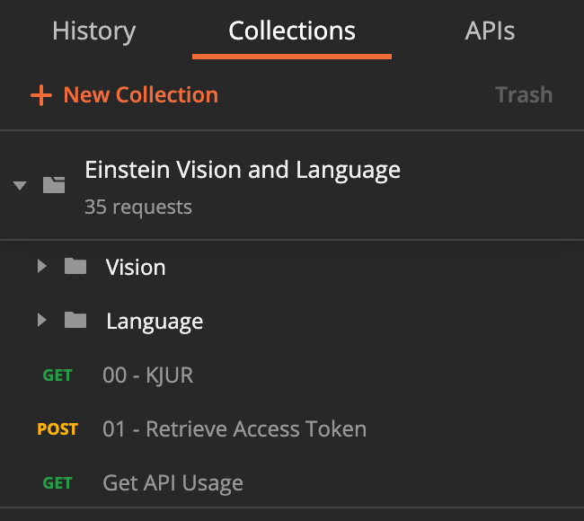
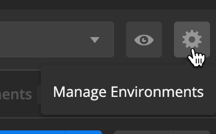
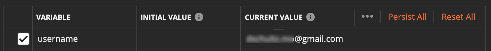
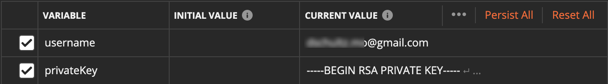
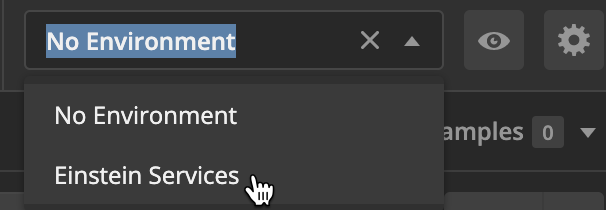
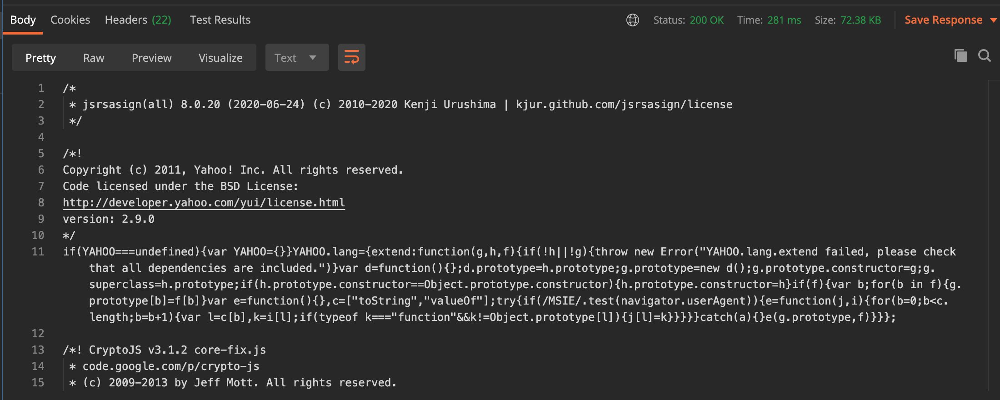
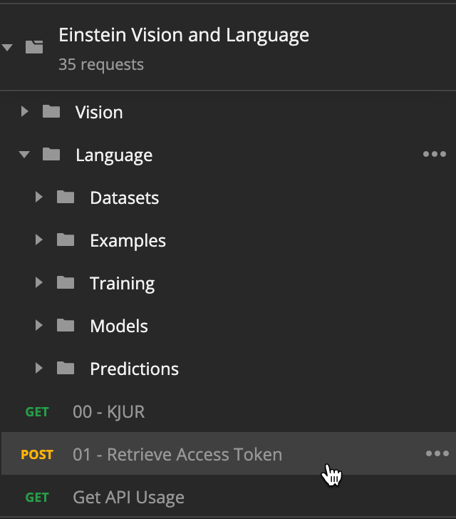
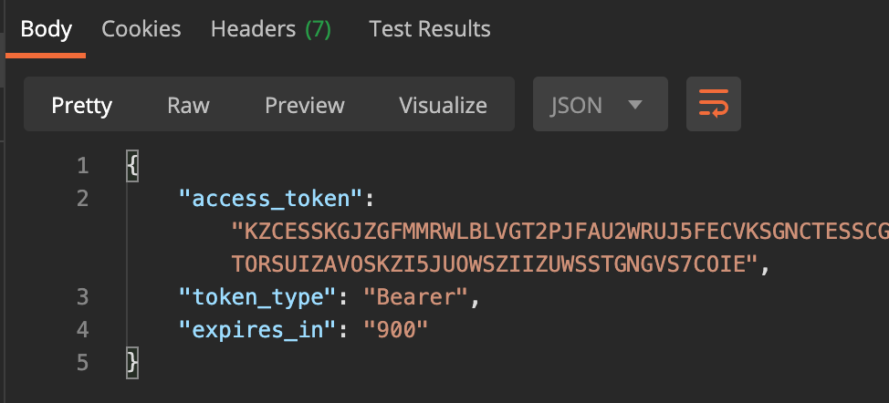

# Einstein Vision and Language Postman Collection *(PostmanForEinstein)*

<!-- 
    This should be identical to the repository name/project name, or a relevant title, with the repo name in the italicized paranthesis. The repo name should be in this title is what I'm gettin at here.
-->

<!-- 
    Badges
    Salesforce badges
        Salesforce API : Version Number
        Lightning Experience : Required / Not Required (Optional, unless using LWC/Aura)
        User License: Sales / Service / Communities / Platform / None (Optional)
        Apex Code Coverage: % 100 green, >75 orange, <75 red (Required if including Apex)
-->    
Einstein Vision and Language lets you build AI-powered apps fast by making the power of image recognition and natural language processing accessible through REST API services.

To communicate with these REST API services, you must either write custom code in a programming language or use a command line or GUI tool to make HTTP requests of the service.

[Postman](https://postman.com) is a very powerful, flexible tool that can be used to interact with the Einstein Vision and Language services.  This repo contains a file that defines a Collection of pre-defined requests for interacting with said services.  Simply import this file, define your Einstein.ai credentials, and you are ready to roll.

*Postman is a collaboration platform for API development. Postman's features simplify each step of building an API and streamline collaboration so you can create better APIs—faster.*

<!-- Longform description. No title here. The quote I stole to define this from the template is - 
* "This should describe your module in broad terms, generally in just a few paragraphs; more detail of the module's routines or methods, lengthy code examples, or other in-depth material should be given in subsequent sections.
Ideally, someone who's slightly familiar with your module should be able to refresh their memory without hitting "page down". As your reader continues through the document, they should receive a progressively greater amount of knowledge." - Kirrily "Skud" Robert, perlmodstyle
-->

## Table of Contents
- [Einstein Vision and Language Postman Collection *(PostmanForEinstein)*](#einstein-vision-and-language-postman-collection-postmanforeinstein)
	- [Table of Contents](#table-of-contents)
	- [Background](#background)
	- [Install](#install)
		- [Dependencies](#dependencies)
	- [Usage](#usage)
		- [Configure your Einstein Credentials](#configure-your-einstein-credentials)
		- [Fetch the KJUR jsrsasign Library](#fetch-the-kjur-jsrsasign-library)
		- [Fetch an Access Token](#fetch-an-access-token)
		- [Do Some Stuff](#do-some-stuff)
			- [Get All Vision Datasets](#get-all-vision-datasets)
			- [Get All Models](#get-all-models)
			- [Predict Image Classification](#predict-image-classification)
	- [Related Projects](#related-projects)
	- [Maintainers](#maintainers)
	- [Contributing](#contributing)
<!-- Optional if doc is less than 100 lines total 
    Link to all sections, start with the next one, don't include anything above. Capture all ## headings, optional to get ### and ####, you do you.
-->

## Background

The Einstein Vision and Language services provide REST API services to developers who want to add AI services into their custom applications - either on or off Salesforce Core.  These are really powerful services, but being developer services, you have to either write custom code or use an HTTP request tool like cURL or Postman to get started.

Postman is a great tool with a solid graphical user interface that can be used to invoke requests to the Einstein Vision and Language APIs.  This project makes using Postman easier in two ways:

1. Provides numerous pre-defined requests for the endpoints of the service.  It doesn't include every single function, but the most common ones are covered and you can probably figure out how to create your own from there.
2. Handles the authentication process for you.  Normally, you would need to go to https://api.einstein.ai/token, enter your email address, upload your PEM file and generate an access token that you would then include in the Authorization header with each request.  This project includes a request that does all this for you.  Just hit the **Retrieve Access Token** request before you start, and all subsequent requests will have a nice, fresh access token.

Don't forget about the [Einstein Vision and Language Model Builder](https://sfdc.co/EinsteinModelBuilder) available on the AppExchange.  The Einstein Vision and Language Model Builder provides a GUI interface as well as invocable Apex methods you can use from within a Salesforce org.  This Postman Collection provides a lower-level debugging client that can be helpful at times.

## Install

1. Install Postman on your local machine, if you haven't already.
2. Copy the `Einstein Vision and Language.postman_collection.json` file from this repository to your local machine.
3. Sign into Postman.  You can use Postman with no account, but it is really better to create an account so your work gets saved when you are done.
4. From Postman, click **Import** at the top of the screen.

5. Click **Upload Files** and select the `Einstein Vision and Language.postman_collection.json` file you copied over to your machine.
6. Click **Import**.
   
Yeah, that's pretty much it for installation.  Now that you have performed the import, you will see an Einstein Vision and Language Collection on the Collections tab.

Check out the Usage section, below, to get started.

### Dependencies
Signing the JWT token is done with the [KJUR jsrsasign](https://www.npmjs.com/package/jsrsasign) library because unlike the built-in Crypto module, it supports RS256 signing.  One of your first steps will be to download this library.

## Usage

### Configure your Einstein Credentials
In order to automate the whole OAuth JWT access token thing, you need to store your Einstein.ai credentials in Environment variables.  You do this once and you will be good to go forevermore... unless you request a new PEM file.

1.  Click the **Manage Environments** Gear Icon in the upper right of the screen.

2.  Click **Add** to create a new Environment. Give it a nice name like `Einstein Services`.
3.  Create an Environment Variable named `username` (Use that name only. You don't get a choice here.).  Enter your Einstein.ai username (the email address you used to sign up for your account) into the CURRENT VALUE area.

4.  Create an Environment Variable named `privateKey` (Use that name only. You don't get a choice here either.).  Paste the contents of your `einstein_platform.pem` file in the CURRENT VALUE area.  I mean the entire text content of the file.

5.  Click **Update** and close the Manage Environments modal.
6.  Select your new environment in the **Environments** combobox in the upper right of the screen.

### Fetch the KJUR jsrsasign Library
This also should be a one-time operation.  

1.  Open the `00 - KJUR` request in the root of the **Einstein Vision and Language** Collection.

2.  Click **Send**.  You will see the minified library text in the Response area of the request.  It has also been saved as a Global Variable so the library can be used anytime you need to sign a JWT token to get an access token.

### Fetch an Access Token
You need an access token each time you make a request to the service.  Requesting an access token is a fairly involved process of creating a JWT token, signing it with the key in your PEM file to create an assertion, then requesting a token from the service by providing that assertion.  The `01 - Retrieve Access Token` request takes care of all that for you.  Yeah, you are welcome.

1. Open the `01 - Retrieve Access Token` request in the root of the **Einstein Vision and Language** Collection.

2.  Click **Send**.  You will see the access token returned by the serivce in the Response area of the request.  It has also been saved as an *Environment* Variable so the other requests can use it in their Authentication headers.

**Note this, friend:** Access tokens expire.  This is a security thing.  By default, it only lasts 15 minutes, and then your client needs to refresh it.  This means you will need to fetch a new access token using this request every 15 minutes - when you start seeing `Invalid access token` responses.  If you would like to override the 15 minute expiration, you can create a variable (Collection, Environment or Global, we aren't picky) named `expInMinutes` and put your value in there.

### Do Some Stuff
As mentioned earlier, most (but not all) of the endpoints supported by the Einstein Vision and Language Service are pre-built for you.  Those that require values in their URL or in body parameters have placeholders that you can, well, replace with your unique values.  Let's try a few requests to get the hang of it.

#### Get All Vision Datasets
1.  Open the **Vision > Datasets** folder
2.  Open the `Get All Datasets` request.  
3.  Click the little expand twistie to the left of the request name.  The documentation of each request includes a link to the corresponding API endpoint documentation.
4.  This request is an example of a request that does not require any unique data like a datasetId or modelId, so we can just send it as-is.
5.  Click **Send**. You will see the response includes the dataset information about the vision datasets in your account.

#### Get All Models
1. Copy the `id` value from one of your Image Classification datasets.
2. Open the `Get All Models` request in the **Vision > Models** folder.
3. Replace the `<DATASET_ID>` text in the URL with the seven digit dataset id you copied earlier.
4. Click **Send**.  You will see the response includes information about all the models for that specific vision dataset.

#### Predict Image Classification
1. Copy the `modelId` of one of your Image Classification models.
2. Open the `Predict Image Classification` request.  This is a POST request which requires parameters to be set in the Body of the request.
3. Click the `Body` tab of the request.
4. Replace the `<MODEL_ID>` text in the modelId parameter with the modelId you copied earlier.
5. Click **Select File** in the Value area of the sampleContent parameter.  Select an image file from your local machine.
6. Click **Send**.  You will see the prediction response returned.

## Related Projects
The [Einstein Vision and Language Model Builder](https://sfdc.co/EinsteinModelBuilder) available on the AppExchange.  
- The Einstein Vision and Language Model Builder provides a GUI interface as well as invocable Apex methods you can use from within a Salesforce org.  This Postman Collection provides a lower-level debugging client that can be helpful at times.

## Maintainers
<!--Small list of folk in charge, not everyone involved.-->
[Dennis Schultz](https://github.com/dschultz-mo)

## Contributing
<!--Give instructions on how to contribute to this repository. Where do I ask questions? Do you accept PRs? What are the requirements to contribute? Don't be a jerk. Use issues if you can.-->
Feel free to submit Issues on this repo if you find things that don't work right or you would like to see improved.

But better still, fork this project and let's see your stuff!
